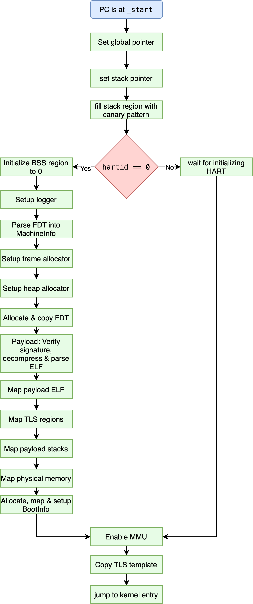
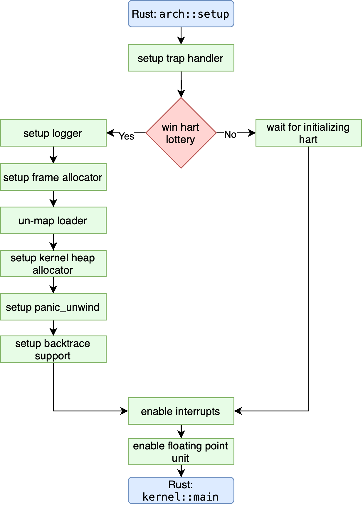

# Boot Flow

k23 uses a *two stage* boot flow, with a smaller, bootloader stage before the actual kernel. This smaller bootloader
is responsible for setting up the environment including virtual memory mapping, TLS (thread local storage) and more.

## Loader Boot Flow

## Kernel Boot Flow

