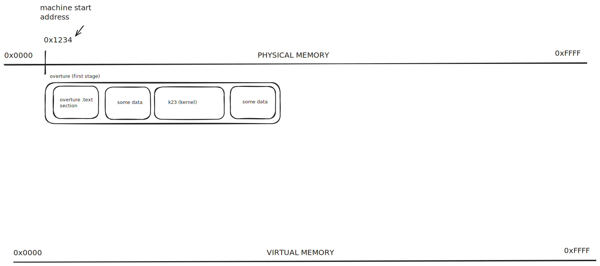
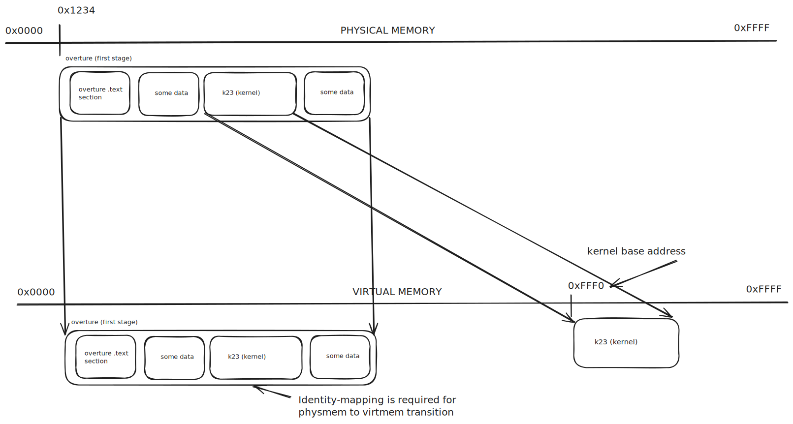
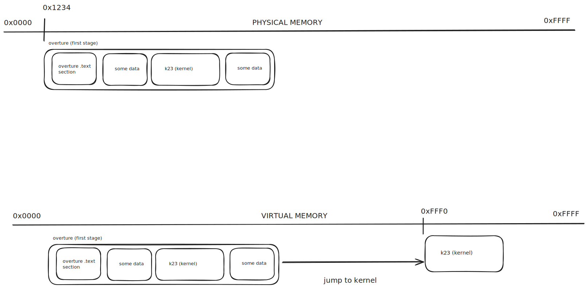
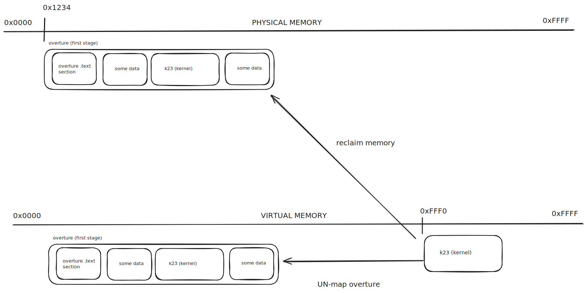
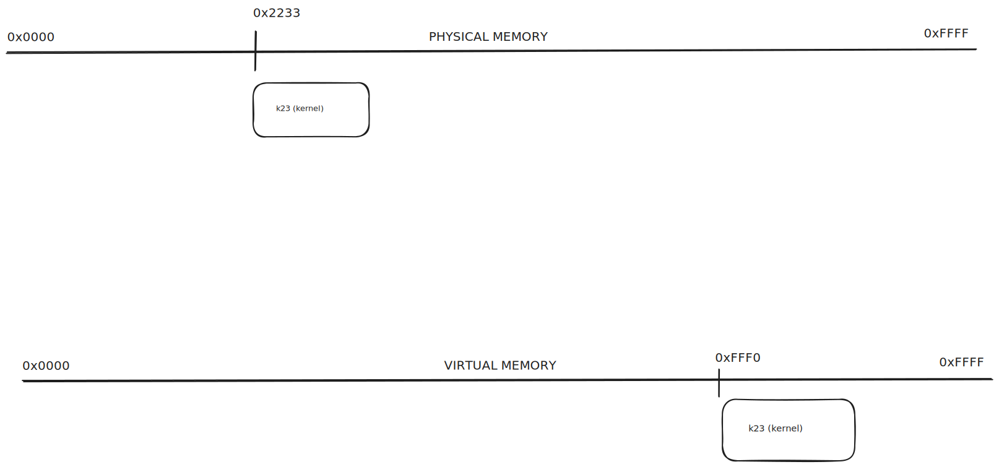

# System Startup

## Overture

Symphony uses a *two stage* boot flow, with a smaller loader stage - called *Overture* - before the actual kernel.
Overture is **not** a full bootloader, its only responsibility is mapping the kernel ELF file into virtual memory and
jumping to it. This includes mapping the thread-local-storage (TLS) blocks declared by the kernel, as well as a stack
for each detected CPU.

A compiled Overture executable contains an *inlined* copy of the Symphony kernel. It is essentially a
[self-extracting executable](https://en.wikipedia.org/wiki/Self-extracting_archive).

There are three primary reasons for splitting into the early boot phase into the separate Overture executable.

1. *Simplified kernel startup code.* The kernel entrypoint is just a simple `extern "C" fn _start()` function which
   gets called by Overture. This lets us focus on the important kernel startup sequence, which is complex enough.
2. *Clean physmem to virtmem transition.* When Overture starts, the MMU is disabled, and we're running in *physical
   memory mode*.
   During startup, we have to enable the MMU and switch into *virtual memory mode*; Doing so however, will invalidate
   all pointers
   into physical memory (unless we have identity-mapped that memory first!). This includes memory containing
   instructions or even
   the stack we use for function calls. Having one executable that deals primarily with physical memory (Overture) and
   one
   that only ever deals with virtual memory (the Symphony kernel) makes it much harder to make stupid mistakes.
3. *Easy early boot cleanup.* Usually boot code (and data) is only ever used during startup. This means that during
   runtime
   our kernel would be carrying around dead memory - memory which is taken up by our ELF file but never accessed! As you
   can
   see below, splitting this boot code into a separate executable lets us easily reclaim this memory for runtime usage.

When the system resets, it will jump to a fixed address in (physical) memory. The exact address depends on the CPU, but
in the diagram below it is `0x1234`. Overture has been loaded at this address into memory by a previous stage
bootloader.

Overture will begin to set up the MMU page translation tables in preparation for the switch to virtual memory. This
means identity mapping itself so it can continue to run after the switch, but more importantly mapping the kernel ELF
file into the higher-half of virtual memory where it expects to live. During this phase Overture will also map TLS (
thread-local storage) blocks and stacks for each detected CPU.

At this point overture has done its job and will hand off control to the Symphony kernel. It does that by jumping to the
ELF entrypoint address it had parsed during the mapping phase. Overture will pass along all information it has collected
about the system through the `BootInfo` struct.

Now that we're inside the kernel, we need to - before moving on with startup - reclaim the now unused Overture memory.
We remove the region from the MMUs page translation tables and then add the now unused memory regions to our pool
of available physical memory. We need to be very careful though to **not** add the kernel ELFs physical memory to that
pool.
Yes, it was part of the Overture image, but it is still in use! We want to surgically reclaim all memory around it
though.

Finally, we're all up and running. The kernel is correctly mapped and Overture fully reclaimed. At this point we can
move on with the system startup.

## Kernel Startup

The Symphony startup is split into three phases: Early, Main, and Late. Additionally, there is Per-CPU and Global
initialization.

|       | Per-CPU                    | Global                |
|-------|----------------------------|-----------------------|
| Early | `arch::per_cpu_init_early` | Rng & DeviceTree init |
| Main  | N/A                        | See below             |
| Late  | `arch::per_cpu_init_late`  | See below             |

During early startup phase we mainly just set up the root random number generator which is local to each CPU. We then
call `arch::per_cpu_init_early` which performs CPU-specific resets like setting the initial FPU state and enabling
performance counters.

The main chunk of Global initialization work happens during the Main phase. This includes setting up the tracing
infrastructure, kernel heap allocator, device-tree, as well as the frame-allocator and virtual memory subsystem. This
will also set up the global state for the scheduler and the WebAssembly-runtimes global `Engine` state.

Lastly, during Late startup `arch::per_cpu_init_late` sets up the exception handler, enables interrupts, and initializes
the timer & IRQ drivers for each CPU.

At this point we are done with startup and enter the  scheduling loop on each CPU.
